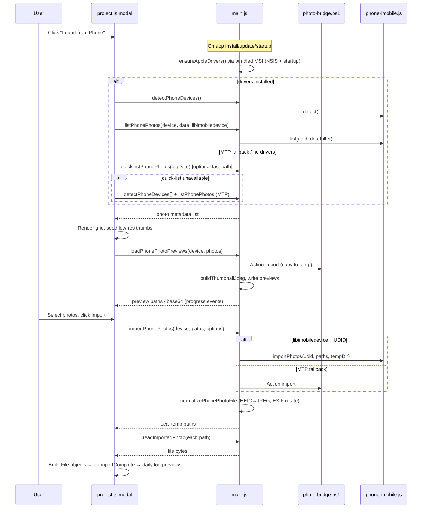

# Import from Phone — Architecture & Process

Oversight Desktop lets users import photos from a connected iPhone (or other MTP portable device) directly into daily log entries. The feature runs entirely on Windows and uses a **dual-backend** design: **libimobiledevice** is the primary transport for listing and import when Apple Mobile Device Support drivers are installed and the user has trusted the computer. **MTP/Shell** remains the fallback when drivers are missing or the user declined Trust.

> **Previous implementation backup:** The pre-migration MTP-primary version is preserved in [`backup/phone-import-mtp-primary/`](../backup/phone-import-mtp-primary/README.md).

---

## Overview

| Aspect | Detail |
|--------|--------|
| **Platform** | Windows only (PowerShell + Windows Shell COM + bundled native tools) |
| **Primary use case** | Import photos into daily log entries, filtered by the log date |
| **UI entry point** | "Import from Phone" button on daily log entry modals |
| **Max photos per entry** | 5 (enforced in the UI after import) |
| **Supported formats** | JPG, JPEG, PNG, HEIC, HEIF, GIF, BMP, TIFF (videos/AAE sidecars skipped) |
| **Driver setup** | Bundled [koush/AppleMobileDeviceSupport](https://github.com/koush/AppleMobileDeviceSupport) MSI installed during app setup (NSIS) and on startup after install/update. `winget` is a fallback if the MSI is missing. |

---

## High-Level Architecture

```
┌─────────────────────────────────────────────────────────────────┐
│  Renderer (project.js)                                          │
│  openPhoneImportModal() → grid UI, selection, import button     │
└───────────────────────────┬─────────────────────────────────────┘
                            │ window.electronAPI (preload.js)
                            ▼
┌─────────────────────────────────────────────────────────────────┐
│  Main process (main.js)                                         │
│  IPC handlers, caching, image normalization, orchestration      │
└───────┬─────────────────────┬─────────────────────┬───────────┘
        │                     │                     │
        ▼                     ▼                     ▼
┌──────────────────┐ ┌───────────────────┐ ┌─────────────────────┐
│ lib/apple-       │ │ lib/phone-        │ │ scripts/photo-      │
│ drivers.js       │ │ imobile.js        │ │ bridge.ps1          │
│ winget driver    │ │ libimobiledevice  │ │ Shell COM / MTP     │
│ lifecycle        │ │ CLI (afcclient…)  │ │ fallback            │
└──────────────────┘ └───────────────────┘ └─────────────────────┘
                │                             │
                └─────────────┬───────────────┘
                              ▼
                    Connected iPhone (USB)
```

### Process layers

1. **Renderer** (`project.js` / `js/project.js`) — modal UI, device detection flow, photo grid, selection, and handing imported `File` objects back to the daily log form.
2. **Preload bridge** (`preload.js`) — exposes typed `window.electronAPI.*` methods over IPC.
3. **Main process** (`main.js`) — coordinates backends, caches, HEIC conversion, thumbnails, and temp file security.
4. **Backends** — two independent ways to talk to the phone; the app picks the best available path per operation.
5. **Driver lifecycle** (`lib/apple-drivers.js`) — bundles `AppleMobileDeviceSupport64.msi`, installs during NSIS setup and on app startup (covers updates/portable). Required by libimobiledevice; not required by the MTP fallback.

---

## Dual Backend Strategy

| Backend | Label in UI | When used | How it works |
|---------|-------------|-----------|--------------|
| **libimobiledevice** | "Trusted USB" | **Default** for both list and import once Apple drivers are present and user tapped Trust | Bundled Windows binaries (`idevice_id`, `afcclient`, `ideviceinfo`) access `/DCIM` and related paths over AFC |
| **MTP** | "Photos USB" | **Fallback only** when drivers are missing or user declined Trust | PowerShell script uses `Shell.Application` COM to browse the device as a portable MTP volume under "This PC", then `CopyHere` to pull files |

### Why this is faster than the old MTP-primary path

| | MTP-primary (backup) | Current (winget + libimobiledevice primary) |
|--|----------------------|---------------------------------------------|
| Listing default | Shell walk + `CopyHere` for previews | `afcclient` when drivers + Trust present |
| Import | Shell `CopyHere` unless trusted | `afcclient get` (significantly faster) |
| Users without iTunes | Slow MTP path | One-time silent driver install via winget |

### Device selection logic (`pickPhoneDevice`)

- If Apple drivers are installed **and** a libimobiledevice device is detected, it is used for **both listing and import**.
- If drivers are missing **or** the user did not tap Trust, MTP is used for listing; import uses libimobiledevice only when a UDID is still available.
- When drivers are installed, the MTP `quick-list` fast path is **skipped** so listing goes through libimobiledevice.
- Duplicate device entries (same iPhone name from both backends) are deduplicated; libimobiledevice entries are sorted first.

### User requirements on the phone

1. Connect via USB and unlock the device.
2. On install or update, the app installs Apple Mobile Device Support from the bundled MSI (installer may run silently; portable/first launch may show one UAC prompt). After that, either:
   - Tap **Trust** → enables the fast libimobiledevice path, or
   - Tap **Allow** for photo access → slower MTP path still works.

---

## End-to-End User Flow



### Step-by-step

1. **Open modal** — `openPhoneImportModal(logDate, onImportComplete)` is called from daily log entry create/edit modals with the log's date as the default filter.

2. **Drivers at install time** — NSIS installer runs `AppleMobileDeviceSupport64.msi` when missing. Each app launch also calls `ensureAppleDrivers()` in the background (covers updates and portable). Phone import only checks status; it does not block on install.

3. **Detect & list**
   - When drivers are installed: `detectPhoneDevices()` then `listPhonePhotos` with **libimobiledevice first**.
   - When drivers are missing: **MTP quick-list** (`quickListPhonePhotos`) if available, else detect + MTP list.
   - MTP path deduplicates iOS duplicates (`IMG_1234` vs `IMG_E1234`); libimobiledevice listing filters by `st_mtime` (EXIF/Photos.sqlite improvements planned — see migration notes below).

4. **Preview grid**
   - Photos render in a selectable grid.
   - Shell thumbs from MTP list display immediately when available.
   - `loadPhonePhotoPreviews` copies via **afcclient** (when libimobiledevice selected) or MTP import, builds ~1200px JPEG previews, and streams progress via `phone-import-preview-progress`.
   - Fallback: `getPhonePhotoThumbnails` if preview loading is unavailable.

5. **Import selected**
   - `importPhonePhotos` copies files to `%TEMP%\oversight-phone-import\<timestamp>\`.
   - Uses **libimobiledevice** when trusted; otherwise **MTP CopyHere**.
   - Reuses `phoneFullCopyCache` if previews already copied the file.
   - Each file is normalized: HEIC→JPEG, JPEG EXIF orientation applied.

6. **Return to form**
   - Renderer reads each temp file via `readImportedPhoto`, wraps bytes in `File` objects.
   - `onImportComplete(files)` runs `preparePhotoFilesForUpload`, adds to the log entry photo list (max 5), and shows previews.
   - On save, photos are compressed to base64 and stored in the project JSON.

---

## Services & Dependencies

### 1. `scripts/photo-bridge.ps1` (MTP / Windows Shell)

Spawned by `main.js` via `powershell.exe -NoProfile -NonInteractive -ExecutionPolicy Bypass -File photo-bridge.ps1`.

| Action | Purpose |
|--------|---------|
| `detect` | Enumerate portable/MTP devices under Shell namespace 17 ("This PC") |
| `list` | Walk device internal storage (`DCIM`, etc.), filter by date, optional thumbnails |
| `quick-list` | `detect` + `list` + thumbnails in one call (used on modal open) |
| `import` | `Shell.NameSpace(dest).CopyHere(srcFile)` per selected path; waits for stable file on disk |
| `thumbnails` | Per-file shell thumbnail via `IShellItemImageFactory` (P/Invoke in embedded C#) |

**Key behaviors:**
- Date filtering uses Shell detail columns (date taken → media created → modified → created).
- iOS folder names like `104APPLE` are always walked even when date-restricted.
- Import waits up to 120s per file for a valid image header and stable file size.
- Large file lists are passed via a temp JSON file (`-FilesPath`) to avoid PowerShell argument limits.

### 2. `lib/phone-imobile.js` (libimobiledevice)

Bundled under `bin/libimobiledevice/` (packaged to `resources/bin/libimobiledevice/`).

| Tool | Role |
|------|------|
| `idevice_id.exe -l` | List connected trusted device UDIDs |
| `ideviceinfo.exe -u <udid> -k DeviceName` | Friendly device name |
| `afcclient.exe ls/info/get` | Browse and download files from `/DCIM`, `/PhotoData/CPLAssets`, etc. |

Listing walks image files recursively, filters by `st_mtime` date, and skips `.aae`, `.mov`, `.mp4`, `.m4v`.

### 3. `lib/apple-drivers.js` (Apple Mobile Device Support lifecycle)

| Function | Purpose |
|----------|---------|
| `checkDriverStatus()` | Fast registry/service probe; cached per session once installed |
| `ensureAppleDrivers()` | Idempotent install via bundled MSI, then `winget` fallback |
| `getMsiPath()` | Resolves `resources/apple-drivers/AppleMobileDeviceSupport64.msi` (from [koush/AppleMobileDeviceSupport](https://github.com/koush/AppleMobileDeviceSupport)) |

MSI asset is downloaded at `npm install` by `scripts/ensure-apple-drivers-asset.js` and bundled via electron-builder `extraResources`. NSIS hook: `build/installer.nsh`.

Required by libimobiledevice (talks to Apple Mobile Device Service). Not required by MTP.

### 4. Node/Electron libraries (main process)

| Package / API | Role |
|---------------|------|
| `heic-convert` | Convert HEIC/HEIF buffers to JPEG |
| `electron.nativeImage` | Resize previews, apply EXIF orientation rotation |
| `child_process.spawn` / `spawnSync` | Run PowerShell, winget, reg, sc, and libimobiledevice CLIs |
| `fs` | Temp dirs, cache, security checks on read paths |

---

## IPC API (`preload.js` → `main.js`)

| Method | Handler | Description |
|--------|---------|-------------|
| `checkAppleDrivers()` | `check-apple-drivers` | Quick registry probe |
| `ensureAppleDrivers()` | `ensure-apple-drivers` | Idempotent silent driver install |
| `onAppleDriversProgress(callback)` | event: `apple-drivers-progress` | Install progress messages |
| `detectPhoneDevices()` | `detect-phone-devices` | Unified detection across both backends |
| `quickListPhonePhotos(dateFilter?)` | `quick-list-phone-photos` | One-shot MTP detect + list + thumbs (skipped when drivers installed) |
| `listPhonePhotos(device, date, options?)` | `list-phone-photos` | libimobiledevice first when drivers OK; MTP fallback |
| `loadPhonePhotoPreviews(device, photos, options?)` | `load-phone-photo-previews` | Full copy + high-res preview generation |
| `upgradePhonePhotoPreviews(device, photos)` | `upgrade-phone-photo-previews` | Same preview build without progress channel |
| `getPhonePhotoThumbnails(device, paths, options?)` | `get-phone-photo-thumbnails` | Batch thumbnail fetch |
| `getPhonePhotoThumbnail(device, path, options?)` | `get-phone-photo-thumbnail` | Single thumbnail |
| `importPhonePhotos(device, paths, options?)` | `import-phone-photos` | Copy + normalize selected files |
| `readImportedPhoto(filePath)` | `read-imported-photo` | Read bytes from allowed temp dirs |
| `readPhonePreview(filePath)` | `read-phone-preview` | Read generated preview JPEG as base64 |
| `onPhoneImportPreviewProgress(callback)` | event: `phone-import-preview-progress` | Copy/preview progress updates |

`deviceOptions` shape: `{ backend: 'libimobiledevice' | 'mtp', udid?: string }`.

---

## Caching

Two in-memory caches in `main.js` (per app session):

| Cache | Key | Purpose |
|-------|-----|---------|
| `phoneThumbCache` | `deviceName\|photoPath` | Base64 JPEG thumbnails |
| `phoneFullCopyCache` | `deviceName\|photoPath` | Local temp path after full copy (skips re-download on import) |

List results with embedded `thumbBase64` are seeded into `phoneThumbCache`. Preview building populates both caches so the final import step can copy from cache when possible.

---

## Image Processing

### Preview generation (`buildThumbnailJpeg`)

- Max dimension: **1200px** (main) / **1280px** (PowerShell shell thumbs).
- HEIC: convert via `heic-convert`, then resize with `nativeImage`.
- JPEG: read EXIF orientation from buffer; rotate if needed before resize.
- Output: JPEG at quality 100 (main) or 96 (PowerShell).

### Import normalization (`normalizePhonePhotoFile`)

- **HEIC/HEIF** → converted to `.jpg` alongside original; original deleted.
- **JPEG with EXIF orientation** ≠ 1 → pixels rotated in-place.
- Other formats pass through unchanged.

---

## Temp File Locations

All under the OS temp directory (`app.getPath('temp')`):

| Path pattern | Contents |
|--------------|----------|
| `oversight-phone-import/<timestamp>/` | Final imported files for user selection |
| `oversight-phone-import/previews-<timestamp>/` | Generated preview JPEGs |
| `oversight-phone-thumbs/<timestamp>-import/` | Intermediate copies for thumbnail building |
| `oversight-phone-thumbs/<timestamp>-imobile/` | libimobiledevice thumbnail staging |
| `oversight-bridge-<timestamp>.json` | Large file-list payloads for PowerShell |

`read-imported-photo` and `read-phone-preview` only allow reads under `oversight-phone-import` and `oversight-phone-thumbs` (path traversal protection).

---

## Timeouts

| Operation | Timeout |
|-----------|---------|
| MTP detect | 30s |
| MTP list (no date filter) | 240s |
| MTP list (with date filter) | 120s |
| MTP import (per batch in main) | 120s (default handler); scales up for preview copies |
| MTP import (per file in PS) | 120s wait for stable file |
| libimobiledevice `afcclient get` | 120s per file |
| libimobiledevice `idevice_id` | 15s |

The UI shows estimated countdowns during list/preview phases based on photo count.

---

## UI Integration Points

`openPhoneImportModal` is wired from:

- **Add log entry** modal — `#daily-log-entry-phone-import`
- **Edit log entry** modal — same pattern

Callback flow:

```javascript
openPhoneImportModal(logDate, async (importedFiles) => {
    const prepared = await preparePhotoFilesForUpload(importedFiles);
    selectedPhotoFiles = [...selectedPhotoFiles, ...prepared].slice(0, MAX_PHOTOS);
    renderPhotoPreviews();
});
```

Imported files go through the same `preparePhotoFilesForUpload` / `compressImageToBase64` pipeline as files chosen via the native file picker.

---

## Error Handling & Fallbacks

| Scenario | Behavior |
|----------|----------|
| No `electronAPI.detectPhoneDevices` | Notification: feature unavailable |
| Bundled MSI missing from build | Fall back to `winget`; if that fails, use MTP path |
| User cancels UAC (portable / startup install) | Use MTP path until drivers are installed |
| NSIS install without admin | MSI step may be skipped; startup install retries with UAC |
| No devices found | Instructions to connect, unlock, trust/allow, retry |
| libimobiledevice list fails (drivers OK) | Fall back to MTP list |
| MTP list fails | Try libimobiledevice list if UDID known |
| libimobiledevice import returns nothing | Fall back to MTP import |
| Individual file copy fails | Collected in `errors[]`; other files still import |
| No photos for filtered date | "Show All Photos" button re-lists without date filter |
| Preview load fails | Grid still works; user can import without previews |
| `quick-list` IPC missing | Falls back to detect + list two-step flow |

---

## Key Source Files

| File | Responsibility |
|------|----------------|
| `js/project.js` | `openPhoneImportModal`, driver setup UI, selection, import orchestration |
| `preload.js` | IPC exposure to renderer |
| `main.js` | IPC handlers, backend orchestration, image processing, caches |
| `lib/apple-drivers.js` | winget driver check/install |
| `lib/phone-imobile.js` | libimobiledevice CLI wrapper |
| `scripts/photo-bridge.ps1` | Windows MTP/Shell bridge (fallback) |
| `bin/libimobiledevice/*` | Bundled libimobiledevice Windows binaries (packaged as extraResources) |
| `backup/phone-import-mtp-primary/` | Frozen pre-migration implementation |
| `package.json` | `heic-convert` dependency; electron-builder `extraResources` for script + binaries |

---

## Packaging Notes

`electron-builder` copies into the built app:

- `scripts/photo-bridge.ps1` → `resources/scripts/`
- `bin/libimobiledevice/**` → `resources/bin/libimobiledevice/`
- `bin/apple-drivers/*.msi` → `resources/apple-drivers/`

At runtime, `getPhotoBridgeScript()` and `phone-imobile.getBinDir()` resolve paths from `process.resourcesPath` when packaged, or from the repo root in development.

---

## Design Rationale (summary)

- **Bundled Apple driver MSI** (koush/AppleMobileDeviceSupport) installs with the app and on startup, so libimobiledevice works without iTunes.
- **libimobiledevice primary** uses `afcclient get` instead of Shell `CopyHere` for listing previews and import when drivers + Trust are present.
- **MTP fallback** preserves functionality when drivers fail, winget is unavailable, or the user only granted photo access (Allow, not Trust).
- **HEIC normalization at import** ensures downstream upload/storage always gets browser-friendly JPEGs.
- **Caches** avoid double-copying when the user previews then imports the same photos.

---

## Future improvements (not yet implemented)

- **EXIF / Photos.sqlite listing** — libimobiledevice currently filters by file `st_mtime`, not `DateTimeOriginal`. Option A: partial EXIF fetch via `exifr`. Option B: read `/PhotoData/Photos.sqlite` once per list (faster, better date accuracy).
- **Settings UI** — manual "Install iPhone Drivers" button to retry after a cancelled UAC prompt.
